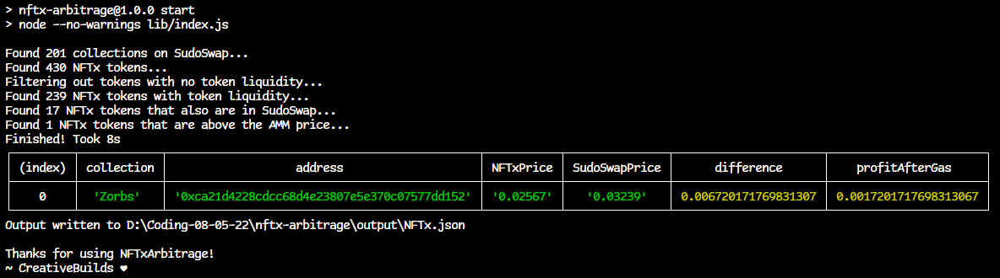

# NFTx x SudoSwap Arbitrage Scouter

### Find listed NFTx assets that are cheaper than the current sell price on SudoSwap.

 This project uses experimental features from **Node v18** please update if you have issues running it.
<br />

## How to use:
1. ) download git project to a new folder `git clone https://github.com/creativebuilds/nftx-arbitrage`
2. ) install node_modules `npm install`
3. ) run `npm start`
4. ) Enjoy arbitrage!

**TIP**: Zoom out your terminal in order to see the full table output

### Example Output


## Module Usage:
An alternative usecase for this package is to run it as a module.

Simply import the functions you need from `lib/utils`

```js
import {GetAllSudoSwapCollections, GetNFTxTokens} from 'nftx-arbitrage/lib/utils';

const SSCollections = await GetAllSudoSwapCollections();
const NFTxTokens = await GetNFTxTokens();

// In order to get the asset info, call GetMintsRedeemsAndSwaps using the vault id found in each NFTx Token

const NFTxTokensExtended = await Promise.all(NFTxTokens.map(async (token) => {
    let {mints, redeems, swaps} = await GetMintsRedeemsAndSwaps(token.id);
    return {
        ...token,
        assetAddress: mints[0]?.vault.asset.id || null,
        mints,
        redeems,
        swaps
    }
}))

console.log(NFTxTokensExtended);
 ```
 
<br />

( OPTIONAL ) to build from source run `npm run build`  
NOTE: you'll receive some errors as the tests folder is not located in `/src` these are nominal


( OPTIONAL ) to test run `npm run test`
